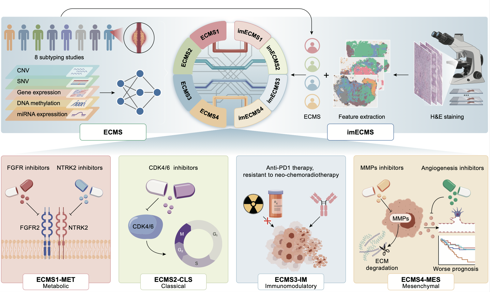

# ESCC_CMS
Esophageal squamous cell carcinoma (ESCC) lacks a standardized classification.  This study presents a novel, robust four-subtype classification system, ECMS (ESCC Consensus Molecular Subtypes): ECMS1-MET (metabolic), ECMS2-CLS (classical), ECMS3-IM (immunomodulatory), and ECMS4-MES (mesenchymal).  Furthermore, we developed imECMS, an image-based classifier using deep learning to assign ESCC patients to these subtypes from H&E images.  ECMS/imECMS subtypes correlate with distinct molecular characteristics, prognoses, and treatment responses, providing a valuable tool for precision medicine in ESCC.

The repository contains the construction of ECMS and the implementation of a user-friendly image classifier(imECMS), including all the code required for generating figures for publication. 


## 1.ESCC Consensus Molecular Subtypes（ECMS) Classifier

## 2.Image Classifier (imECMS)
The imECMS.Rmd provides the code for imECMS classifier.

How to Use:
	•	Replace trained_model, user_tissue_features, and clinical_data with actual input data and model variables.
 
```r
# Load the trained model
# load("./final_trained_model.rdata")  # Uncomment and replace with the model file path

# Predict results using the test dataset
test_data <- user_tissue_features  # Input user tissue feature data
prediction_results <- predict(trained_model, test_data)  # Predicted labels
prediction_probabilities <- predict(trained_model, test_data, probability = TRUE)  # Predicted probabilities

# Predict results for core samples
merged_data <- merge(user_core_samples, test_data, by = "row.names", all = FALSE)[, -c(1, 2)]  # Merge and clean data
core_predictions <- predict(trained_model, merged_data)  # Predict core samples

# Majority voting based on patient IDs
sample_names <- substr(rownames(test_data), 1, 9)  # Extract patient IDs
unique_patient_ids <- unique(sample_names)  # Unique patient IDs

voting_results <- sapply(unique_patient_ids, function(patient_id) {
  # Get predictions for current patient
  indices <- which(sample_names == patient_id)
  patient_predictions <- prediction_results[indices]
  freq_table <- table(patient_predictions)  # Frequency table for predictions
  
  # Majority voting logic
  if (sum(freq_table == max(freq_table)) >= 2) {
    result <- NA  # Tie condition
  } else {
    result <- names(freq_table)[which.max(freq_table)]  # Most frequent prediction
  }
  
  # Override condition for ECMS4 presence
  if (freq_table[which.max(freq_table)] != length(indices) && "ECMS4" %in% names(freq_table)) {
    result <- "ECMS4"
  }
  
  return(result)
})

# Match predictions with clinical data
voting_results <- voting_results[match(clinical_data$Patient_ID, names(voting_results))]
final_results_df <- data.frame(Patient_ID = names(voting_results), Predicted_Label = voting_results)

# Display final results
print(final_results_df)
```

Author(Zhu Zhongxu, Zhang Yinghan)
